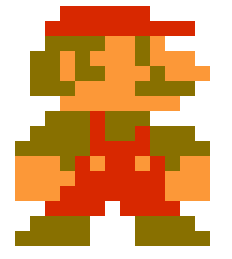

# px - A pixel-based canvas rendering library

## Quick Start

Add px to your page.

```html
<script src="path/to/px.js"></script>
```

Via JsDelivr

```html
<script src="https://cdn.jsdelivr.net/gh/brookesb91/px@v0.3/px.js"></script>
```

Create a root element.

```html
<div id="stage"></div>
```

Render sprites using JavaScript.

```js
render(
  {
    selector: '#stage',
    layers: ['foreground'],
    height: 16,
    width: 16,
    size: 15,
  },
  [
    sprite({
      palette: () => ['transparent', '#D82800', '#887000', '#FC9838'],
      layer: () => 'foreground',
      render: () => [
        [0, 0, 0, 0, 1, 1, 1, 1, 1, 1, 0, 0, 0, 0, 0],
        [0, 0, 0, 1, 1, 1, 1, 1, 1, 1, 1, 1, 1, 0, 0],
        [0, 0, 0, 2, 2, 2, 2, 3, 3, 2, 3, 0, 0, 0, 0],
        [0, 0, 2, 2, 3, 2, 3, 3, 3, 2, 3, 3, 3, 0, 0],
        [0, 0, 2, 2, 3, 2, 2, 3, 3, 3, 2, 3, 3, 3, 0],
        [0, 0, 2, 2, 2, 3, 3, 3, 3, 2, 2, 2, 2, 0, 0],
        [0, 0, 0, 0, 3, 3, 3, 3, 3, 3, 3, 3, 0, 0, 0],
        [0, 0, 0, 2, 2, 2, 1, 2, 2, 2, 0, 0, 0, 0, 0],
        [0, 0, 2, 2, 2, 2, 1, 2, 2, 1, 2, 2, 2, 0, 0],
        [0, 2, 2, 2, 2, 2, 1, 1, 1, 1, 2, 2, 2, 2, 0],
        [0, 3, 3, 3, 2, 1, 3, 1, 1, 3, 1, 2, 3, 3, 0],
        [0, 3, 3, 3, 3, 1, 1, 1, 1, 1, 1, 3, 3, 3, 0],
        [0, 3, 3, 3, 1, 1, 1, 1, 1, 1, 1, 3, 3, 3, 0],
        [0, 0, 0, 1, 1, 1, 1, 0, 1, 1, 1, 1, 0, 0, 0],
        [0, 0, 2, 2, 2, 2, 0, 0, 0, 2, 2, 2, 2, 0, 0],
        [0, 2, 2, 2, 2, 2, 0, 0, 0, 2, 2, 2, 2, 2, 0],
      ],
    }),
  ]
);
```

### Result



[Try It Online!](https://codepen.io/pen/?template=GRMJVOY)

## In-Depth

Rendering requires calling the `render` function with a `RenderConfig` object and an array of sprites.

```js
render(config, sprites);
```

### The `RenderConfig` object

| Property   | Type       | Default | Description                                                            |
| ---------- | ---------- | ------- | ---------------------------------------------------------------------- |
| `selector` | `string`   | n/a     | Query selector for the root element.                                   |
| `size`     | `number`   | `0`     | The height and width in screen pixels of each sprite pixel.            |
| `height`   | `number`   | `0`     | The height of the rendering in sprite pixels.                          |
| `width`    | `number`   | `0`     | The width of the rendering in sprite pixels.                           |
| `layers`   | `string[]` | `[]`    | A list of named rendering layers. Lowest layer is at the lowest index. |

Define a sprite by calling the `sprite` function. A rendering accepts an array of sprites.

```js
render(
  {
    /* Render config */
  },
  /* Sprites to render */
  [
    sprite({
      /* Sprite config */
    }),
  ]
);
```

A rendering is created on an initial call to `render` and each subsequent frame using `requestAnimationFrame`. On each frame, each sprite builder method is called before being rendered to its canvas. Each `Frame` contains a current and delta timestamp and is provided to each of the builders.

### The `Frame` object

| Property | Type     | Description                            |
| -------- | -------- | -------------------------------------- |
| `time`   | `number` | The current time stamp.                |
| `delta`  | `number` | The time elapsed since the last frame. |

### The `SpriteConfig` object

| Property   | Type                                                                 | Default       | Description                                                                                                                         |
| ---------- | -------------------------------------------------------------------- | ------------- | ----------------------------------------------------------------------------------------------------------------------------------- |
| `state`    | `(frame: Frame) => Record<string, unknown>`                          | `() => ({})`  | Optional state builder. Return a state for the sprite. Note that `px` does not provided state management.                           |
| `layer`    | `(frame: Frame, state: Record<string, unknown>) => string`           | n/a           | Layer builder. Returns the name of the layer this sprite is to be rendered to. Must match a layer provided in the `RenderConfig`.   |
| `position` | `(frame: Frame, state: Record<string, unknown>) => [number, number]` | `() => [0,0]` | Position builder. Returns the positional offset of the sprite. The first value is the x position and the second is the y position.  |
| `palette`  | `(frame: Frame, state: Record<string, unknown>) => string[]`         | `() => []`    | Palette builder. Returns a palette of colours to be used when rendering this sprite. A palette is an array of valid colour strings. |
| `render`   | `(frame: Frame, state: Record<string, unknown>) => number[][]`       | `() => []`    | Pixels builder. Returns the pixels for the sprite. Each pixel is a valid index of the sprite palette.                               |

The builders are called in the order they are listed above.
